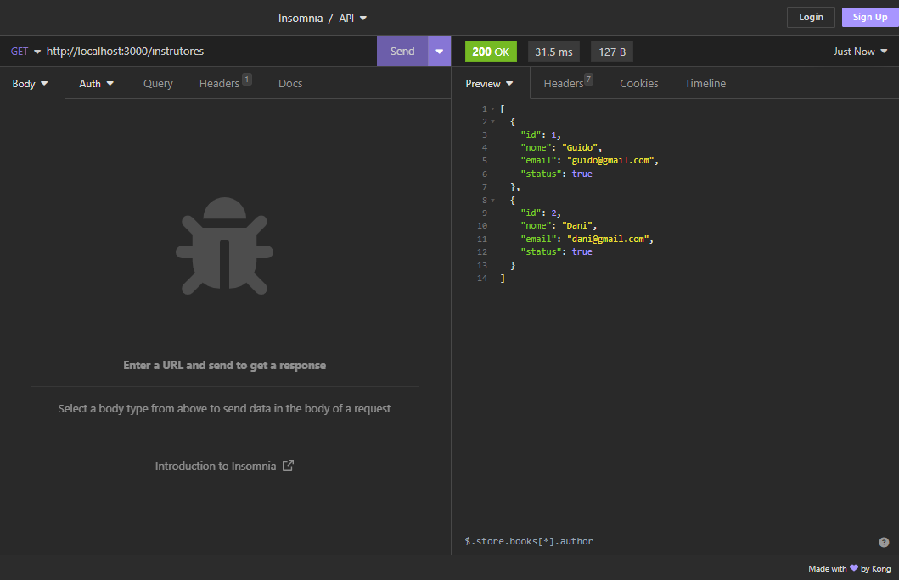
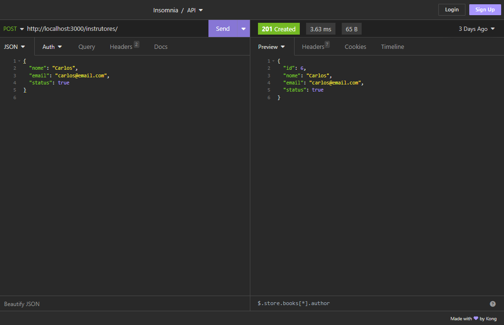
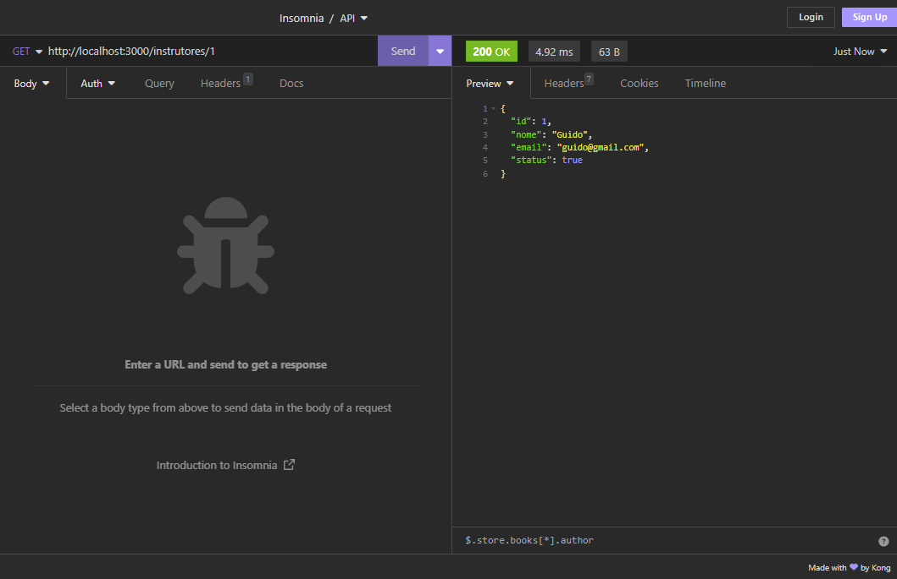

# API de Estudo - Listar Instrutores Cubos Academy

## Sobre o Projeto

Projeto de estudo apresentado pela Cubos academy no curso de Desenvolvimento Backend.

Esta API faz o Cadastro de um Instrutor, Lista todos os Instrutores Cadastrados e Filtra apenas um Instrutor.

## Tecnologias Utilizadas

- JavaScript
- Node.js
- Insomnia

## Como executar o Projeto

```bash
# Clonar Repositório
git clone https://github.com/BrunoVit0r/listar-instrutores-cubos-academy

# Entrar na pasta do projeto backend
cd listar-instrutores-cubos-academy

#Inicializar um projeto com NPM
npm run dev

# Se necessário configurar o arquvio JSON. 
 "scripts": {
    "dev": "nodemon ./src/index.js"
  }

# Abrir o Insomnia

Eu utilizei o aplicativo insomnia para validar os códigos, mas você pode usar outro de sua preferência.

```

## Listar os Instrutores

<p align="center">
   
</p>


## Cadastrar um Instrutor

<p align="center">
   
</p>


## Obter um Instrutor

<p align="center">
   
</p>


### Para saber mais sobre minha jornada de aprendizado em Backend

#### Bruno Vitor
#### https://www.linkedin.com/in/bruno-vitor/


